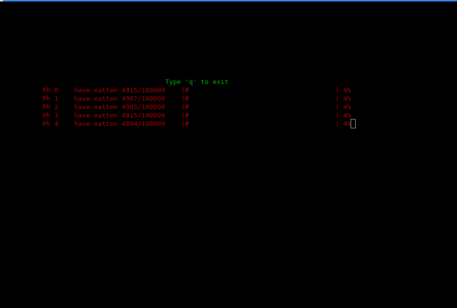
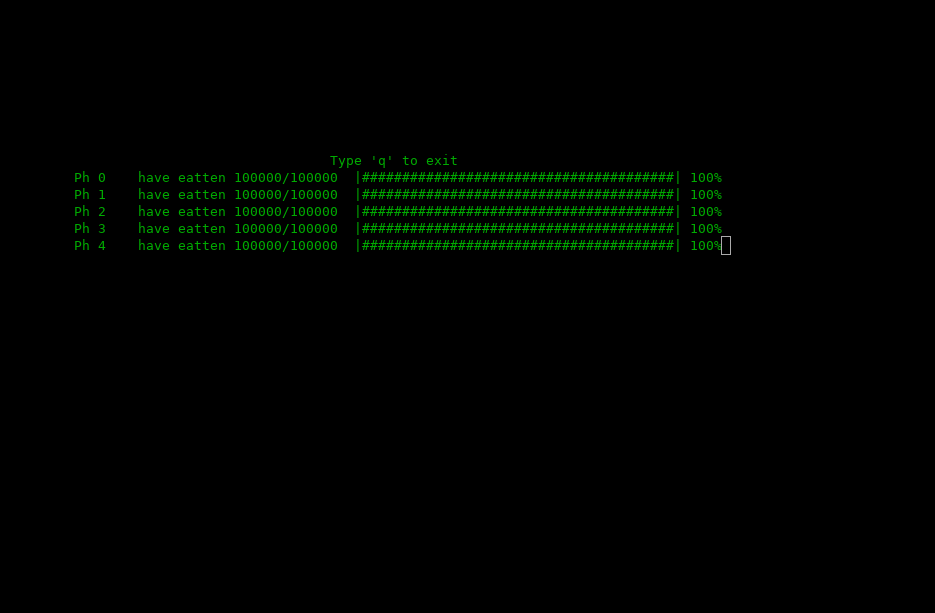

# Dining philosopher problem

## Requirements
 - g++
  ```apt install g++```
 - ncurses
  ```apt install libncurses-dev```
- installed fmt-dev 5.0+
 ```apt install fmt-dev``` or build from ```https://github.com/fmtlib/fmt```

## Compilation
1. mkdir build && cd build
2. cmake ..
3. make

## Usage
Just run `./so_app`. When you want to quit press 'q'.
When you want to configure application, see `config.hpp` file.
There you can find some variables which you can simply modify.
Save changes recompile and see results.

## Samples



